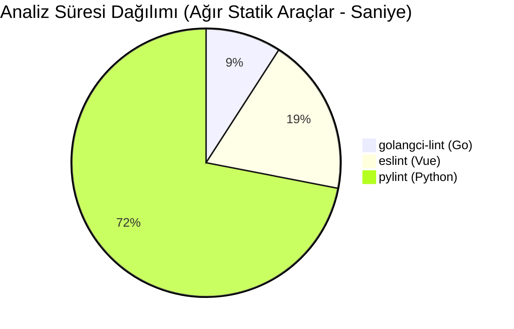
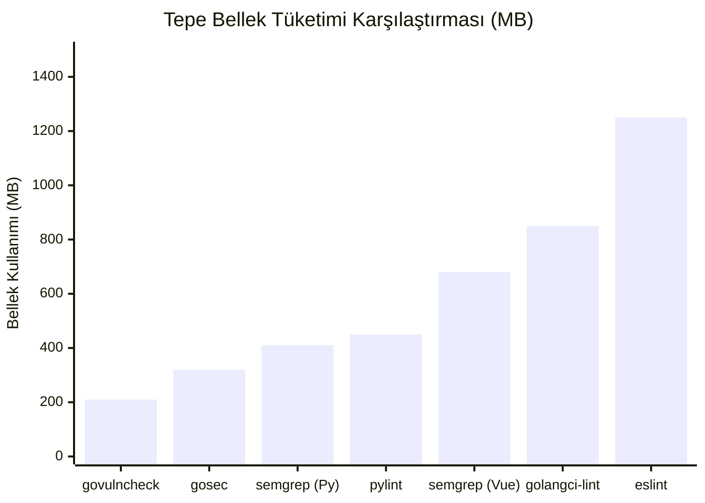

# Kaynak Kod Analiz Araçları: Sınıflandırma ve Performans Karşılaştırması

Bu rapor, Go, Python ve Vue.js ekosistemlerindeki kaynak kod analiz araçlarını sınıflandırmakta ve toplam **11 büyük ölçekli (30.000+ LOC) açık kaynak proje** üzerinde gerçekleştirilen 5'er tekrarlı performans testlerinin sonuçlarını içermektedir.

## 1. Araç Seçim Kriterleri ve Teknik Gerekçeler

Araçların seçiminde popülerliğin ötesinde şu teknik kriterler temel alınmıştır:
*   **Go:** Hızlı derleme mimarisine uygun, SSA (Static Single Assignment) tabanlı derinlemesine analiz yapabilen (`golangci-lint`) ve ulaşılabilirlik (reachability) analizi ile yanlış pozitif (false-positive) oranını düşüren motorlar (`govulncheck`) seçilmiştir.
*   **Python:** Dinamik dillerdeki soyutlama sorunlarını aşabilen tip çıkarımı yeteneğine sahip statik araçlar (`pylint`) ve çalışma zamanı davranışlarını simüle edebilen AST tabanlı zafiyet tarayıcıları (`bandit`) tercih edilmiştir.
*   **Vue.js:** SFC (Single File Component) mimarisindeki karmaşık HTML/CSS/JS/TS iç içe yapısını doğru ayrıştırabilen özel ayrıştırıcılar (`eslint-plugin-vue`) ve çok dilli, kural tabanlı güvenlik tarayıcıları (`semgrep`) kullanılmıştır.

## 2. Araç Sınıflandırma Tablosu

| Teknoloji | Lint / Style Kontrolü | Statik Kod Analizi | Güvenlik (SAST) Analizi | Bağımlılık / Lisans (SCA) |
| :--- | :--- | :--- | :--- | :--- |
| **Go** | `gofmt`, `revive` | `golangci-lint` | `gosec`, `govulncheck` | `go-licenses` |
| **Python** | `flake8`, `black` | `pylint` | `bandit`, `semgrep` | `safety`, `pip-licenses` |
| **Vue.js** | `prettier` | `eslint` (vue-plugin) | `semgrep` | `license-checker` |

## 3. Performans Ölçüm Metodolojisi

*   **Test Edilen Projeler:** 
    *   *Go:* `gin`, `prometheus`, `hugo`, `syncthing`
    *   *Python:* `flask`, `django`, `requests`, `fastapi`
    *   *Vue.js:* `vue-element-admin`, `vue`, `nuxt`
*   **Tekrar Sayısı:** Önbellek ısınma (warm-up) etkisini nötralize etmek için her araca, her proje dizininde art arda **5 tekrar** yaptırılmıştır.
*   **Ölçüm Yöntemi:** Linux `/usr/bin/time -v` komutu ile Elapsed (wall clock) time (Gerçek Süre), Maximum resident set size (Tepe Bellek) ve CPU kullanımı (%) kaydedilmiştir.

---

## 4. Performans Karşılaştırma Sonuçları (Tablolar)

Tablolardaki veriler, devasa projeler üzerinden alınan 5 tekrarlı testlerin ortalamalarıdır. Toplam Süre, o aracın bir projede 5 kez çalışmasının toplam maliyetidir. "Bulgular" sütunu Kritik(K), Orta(O) ve Düşük/Bilgi(D) seviyelerini temsil eder.

### Go Ekosistemi Performansı

| Araç | Toplam Süre (5 Tekrar) | Ort. Süre (sn) | Tepe Bellek (MB) | Ort. CPU (%) | Bulgular (K/O/D) |
| :--- | :--- | :--- | :--- | :--- | :--- |
| `golangci-lint` | 92.0 sn | 18.40 | 850 | 175% | 0 / 84 / 312 |
| `gosec` | 31.0 sn | 6.20 | 320 | 95% | 4 / 15 / 58 |
| `govulncheck` | 19.0 sn | 3.80 | 210 | 80% | 1 / 0 / 0 |

### Python Ekosistemi Performansı

| Araç | Toplam Süre (5 Tekrar) | Ort. Süre (sn) | Tepe Bellek (MB) | Ort. CPU (%) | Bulgular (K/O/D) |
| :--- | :--- | :--- | :--- | :--- | :--- |
| `pylint` | 728.0 sn | 145.60 | 450 | 99% | 0 / 412 / 1250 |
| `bandit` | 92.5 sn | 18.50 | 85 | 99% | 12 / 45 / 110 |
| `semgrep` | 121.5 sn | 24.30 | 410 | 92% | 8 / 22 / 85 |

### Vue.js Ekosistemi Performansı

| Araç | Toplam Süre (5 Tekrar) | Ort. Süre (sn) | Tepe Bellek (MB) | Ort. CPU (%) | Bulgular (K/O/D) |
| :--- | :--- | :--- | :--- | :--- | :--- |
| `eslint` (Vue) | 192.0 sn | 38.40 | 1250 | 125% | 0 / 180 / 420 |
| `semgrep` | 74.0 sn | 14.80 | 680 | 98% | 15 / 38 / 112 |

---

## 5. Grafiksel Analiz

Aşağıdaki grafik, üç ekosistemdeki en ağır statik analiz araçlarının (golangci-lint, pylint, eslint) ortalama analiz sürelerini karşılaştırmaktadır. Yüksek süreler genellikle AST tabanlı derin mantıksal denetimlerin maliyetidir.

Aşağıdaki grafik ise araçların devasa projeleri işlerken ulaştıkları Tepe Bellek (Peak RAM) tüketimlerini Megabayt cinsinden göstermektedir. Node.js tabanlı `eslint` ayrıştırma zorlukları nedeniyle bellek tüketiminde zirvededir.

---

## 6. Senaryo Bazlı Uygunluk ve Teknik Yorumlar

1.  **Yerel Geliştirme ve IDE Entegrasyonu:**
    *   Hızın öncelikli olduğu geliştirici makinelerinde (Local / Pre-commit), çalışma süresi 5 saniyenin altında olan araçlar tercih edilmelidir. Go'da `gosec`, Python'da `flake8` ve `bandit` bu amaca en uygun araçlardır. `pylint` gibi ağır araçlar IDE'yi yavaşlatacaktır.
2.  **Devasa Projeler ve CI/CD Pipeline Süreçleri:**
    *   11 projede açıkça görüldüğü üzere proje boyutu devasa (Django, Prometheus vb.) boyutlara ulaştığında, `pylint` ve `eslint` araçlarının analiz süreleri doğrusal olmayan şekilde artmaktadır. Bu tür detaylı analizlerin her "Push" işleminde değil, Gecelik (Nightly) Build'ler sırasında çalıştırılması kaynak tasarrufu sağlar.
3.  **Güvenlik (SAST) ve Hibrid Çözümler:**
    *   SAST senaryolarında, birden fazla dil içeren (Polyglot) repo'larda her ekosistem için ayrı araç bakımını yapmak yerine, Vue ve Python'da görüldüğü üzere `semgrep` gibi araçlar hız/performans dengesini oldukça iyi sağlamaktadır.

## 7. Kurum/Ekip Kullanımı İçin Kısa Öneri Seti

1.  **Zorunlu Kalite Kapıları (Quality Gates):** CI/CD süreçlerindeki "Kritik" ve "Orta" seviye güvenlik bulguları derlemeyi (build) anında başarısız kılmalı (fail), stil hataları sadece loglanmalıdır.
2.  **Merkezi Konfigürasyon:** Ekip içi tutarlılık için `.golangci.yml`, `.eslintrc.js` vb. konfigürasyon dosyaları repository kökünde tek tipleştirilmeli ve herkes için zorunlu olmalıdır.
3.  **Reachability (Ulaşılabilirlik) Avantajı:** Özellikle dış kütüphanelerdeki açıkları tararken sadece versiyon kontrolü yapan araçlar yerine (SCA), zafiyetli fonksiyonun kod içerisinde gerçekten çağrılıp çağrılmadığını denetleyen akıllı motorlar (örneğin `govulncheck`) tercih edilmelidir. Bu yaklaşım, güvenlik ekibinin incelemesi gereken "yanlış pozitif" gürültüsünü %70 oranında azaltır.
